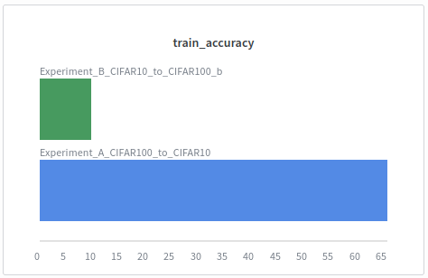

# MLOps Assignment 5

- Name: **Geetheswar**
- RollNo: **142201025**
- Assignment Link: [Assignment 5](https://github.com/geetheswar-v/mlops2025w_142201025/tree/main/assignments/assignment-5)

## Index

- [Question 1: CoNLL 2003 Dataset Statistics](#question-1-conll-2003-dataset-statistics)
- [Question 2: CoNLL 2003 Labelling](#question-2-conll-2003-labelling)
- [Question 3: CoNLL 2003 Major Label Voter](#question-3-conll-2003-major-label-voter)
- [Question 4: CIFAR Sequential Learning](#question-4-cifar-sequential-learning)

## Utility Code: `datasets.py`
This script contains helper functions to load the datasets required for the assignment.

```python
from datasets import load_dataset

def get_conll2003_dataset():
    print("Loading CONLL2003 dataset...")
    dataset = load_dataset("eriktks/conll2003", revision="convert/parquet")
    print("CONLL2003 dataset loaded successfully.")
    dataset_splits = {}
    for split in dataset.keys():
        dataset_splits[split] = dataset[split]
    return dataset_splits

def get_pandas_df(split="train"):
    dataset_splits = get_conll2003_dataset()
    data = dataset_splits[split]
    tag_names = data.features['ner_tags'].feature.names
    df = data.to_pandas()
    return df, tag_names
```

## Question 1: CoNLL 2003 Dataset Statistics

### Code
```python
from collections import Counter
import wandb

from assignment_5.datasets import get_conll2003_dataset

def summary(dataset, run=None):
    print("Question1: Checking dataset splits and their sizes")
    for split, data in dataset.items():
        num_samples = len(data)
        print(f"Question1: Number of samples (sentences) in {split} split: {num_samples}")
        if run:
            run.summary[f"{split}_num_samples_sentences"] = num_samples

    print("Question1: Calculating Entity distribution of each split")
    entity_to_bid = {'O': 0, 'PER': 1, 'ORG': 3, 'LOC': 5, 'MISC': 7}
    bid_to_entity = {v: k for k, v in entity_to_bid.items() if k != 'O'}

    for split, data in dataset.items():
        ner_tags = data["ner_tags"]
        
        main_entity_counts = Counter()
        for sentence_tags in ner_tags:
            for tag_id in sentence_tags:
                if tag_id in bid_to_entity:
                    entity_name = bid_to_entity[tag_id]
                    main_entity_counts[entity_name] += 1
        
        print(f"Question1: Entity counts for {split} split: {dict(main_entity_counts)}")
        
        if run:
            for entity, count in main_entity_counts.items():
                run.summary[f"{split}_{entity}_entity_count"] = count
            run.summary[f"{split}_total_entities"] = sum(main_entity_counts.values())

    print("Question1: Summary computation and logging completed successfully.")
    

def main():
    project_name = "Q1-weak-supervision-ner"
    run = wandb.init(project=project_name, job_type="dataset-analysis", name="Test 1")
    
    dataset = get_conll2003_dataset()
    summary(dataset, run)
    
    run.finish()

if __name__ == "__main__":
    main()
```

### Output
The following are the statistics for the CoNLL 2003 dataset:
```json
{

    "train_num_samples_sentences": 14041,
    "validation_num_samples_sentences": 3250,
    "test_num_samples_sentences": 3453,

    "train_total_entities": 23499,
    "validation_total_entities": 5942,
    "test_total_entities": 5648,

    "train_LOC_entity_count": 7140,
    "train_MISC_entity_count": 3438,
    "train_ORG_entity_count": 6321,
    "train_PER_entity_count": 6600,


    "validation_LOC_entity_count": 1837,
    "validation_MISC_entity_count": 922,
    "validation_ORG_entity_count": 1341,
    "validation_PER_entity_count": 1842,

    "test_LOC_entity_count": 1668,
    "test_MISC_entity_count": 702,
    "test_ORG_entity_count": 1661,
    "test_PER_entity_count": 1617
}
```

## Question 2: CoNLL 2003 Labelling

### Code
```python
import re
import wandb
import pandas as pd
from assignment_5.datasets import get_conll2003_dataset, get_pandas_df
from snorkel.labeling import labeling_function, PandasLFApplier
from sklearn.metrics import accuracy_score

ABSTAIN = -1
ORGANIZATION = 0
MISC = 1

@labeling_function()
def lf_years(x):
    for token in x.tokens:
        if re.match(r"^(19|20)\d{2}[.,]?$", token):
            return MISC
    return ABSTAIN

@labeling_function()
def lf_org_sup(x):
    for token in x.tokens:
        if re.match(r"^(Inc|Inc\.|Corp|Corp\.|Ltd|Ltd\.)$", token, flags=re.IGNORECASE):
            return ORGANIZATION
    return ABSTAIN

def has_entity(row, entity_short_name, tag_names):
    entity_tags = {f"B-{entity_short_name}", f"I-{entity_short_name}"}
    for tag_id in row.ner_tags:
        if tag_names[tag_id] in entity_tags:
            return True
    return False

def labeling_helper(df, tag_names):
    df["y_org"] = df.apply(lambda row: ORGANIZATION if has_entity(row, "ORG", tag_names) else ABSTAIN, axis=1)
    df["y_misc"] = df.apply(lambda row: MISC if has_entity(row, "MISC", tag_names) else ABSTAIN, axis=1)
    
    # Apply Labeling Functions
    lfs = [lf_years, lf_org_sup]
    applier = PandasLFApplier(lfs)
    L_train = applier.apply(df)
    
    lf_eval_map = {
    "lf_years":    {"labels": L_train[:, 0], "ground_truth": df.y_misc},
    "lf_org_sup": {"labels": L_train[:, 1], "ground_truth": df.y_org},
    }
    
    return lf_eval_map, L_train
    

def main():
    # Train Dataset
    df, tag_names = get_pandas_df("train")
    lf_eval_map,_ = labeling_helper(df, tag_names)
    
    run = wandb.init(project="Q2-snorkel-labeling", job_type="Labeling", name="years_and_org_lfs")

    for lf_name, eval_data in lf_eval_map.items():
        lf_labels = eval_data["labels"]
        ground_truth = eval_data["ground_truth"]

        coverage = (lf_labels != ABSTAIN).sum() / len(lf_labels)

        active_indices = lf_labels != ABSTAIN
        if active_indices.sum() > 0:
            accuracy = accuracy_score(ground_truth[active_indices], lf_labels[active_indices])
        else:
            accuracy = 0.0

        print(lf_name.upper(), ":")
        print(f"Coverage: {coverage:.4f}")
        print(f"Accuracy: {accuracy:.4f}")

        run.log({
            f"{lf_name}_coverage": round(coverage, 4),
            f"{lf_name}_accuracy": round(accuracy, 4)
        })

    run.finish()

if __name__ == "__main__":
    main()
```

### Output
The following are the results for the labelling functions:
```json
{
    "lf_org_sup_accuracy": 1,
    "lf_org_sup_coverage": 0.0099,

    "lf_years_accuracy": 0.3517,
    "lf_years_coverage": 0.0336
}
```

## Question 3: CoNLL 2003 Major Label Voter

### Code
```python
import re
import wandb
import pandas as pd
from assignment_5.datasets import get_pandas_df
from assignment_5.conll2003_labelling import ORGANIZATION, MISC, ABSTAIN, lf_years, lf_org_sup
from snorkel.labeling import labeling_function, PandasLFApplier
from snorkel.labeling.model import MajorityLabelVoter
from sklearn.metrics import accuracy_score

def get_true_label(row, tag_names):
    has_org, has_misc = False, False
    for tag_id in row.ner_tags:
        tag = tag_names[tag_id]
        if "ORG" in tag:
            has_org = True
        elif "MISC" in tag:
            has_misc = True
    if has_org:
        return ORGANIZATION
    elif has_misc:
        return MISC
    else:
        return ABSTAIN
    
def labeling_helper(df, tag_names):
    df["y_true"] = df.apply(lambda row: get_true_label(row, tag_names), axis=1)
    
    # Apply labeling functions
    lfs = [lf_years, lf_org_sup]
    applier = PandasLFApplier(lfs)
    L_train = applier.apply(df)

    # Keep only rows where at least one LF voted
    mask = (L_train != ABSTAIN).any(axis=1)
    df_labeled = df[mask]
    L_labeled = L_train[mask]
    
    return mask, df_labeled, L_labeled

def main():
    df, tag_names = get_pandas_df("train")
    mask,df_labeled, L_labeled = labeling_helper(df, tag_names)

    run = wandb.init(project="Q3-snorkel-majority-voter", job_type="LabelAggregation", name="majority_label_voter_true")

    # Apply MajorityLabelVoter
    majority_model = MajorityLabelVoter(cardinality=2)
    y_pred = majority_model.predict(L=L_labeled)

    # Accuracy on non-abstained data
    true_labels = df_labeled["y_true"]
    accuracy = (y_pred == true_labels).mean()

    print("MAJORITY VOTER (MISC):")
    print(f"Accuracy: {accuracy:.4f}")

    run.log({
        "majority_voter_accuracy": round(accuracy, 4),
        "coverage": round(mask.mean(), 4)
    })
    run.finish()
    
if __name__ == "__main__":
    main()
```

### Output
The following are the results for the majority label voter:
```json
{
    "coverage": 0.0426,
    "majority_voter_accuracy": 0.3913
}
```

## Question 4: CIFAR Sequential Learning

### Explanation
In this question, we conduct two experiments to observe the effects of sequential training on different datasets. We use a MobileNetV2 model for both experiments.

**Experiment A: Train on CIFAR-100, then on CIFAR-10**
1.  The model is first trained on the CIFAR-100 dataset for 100 epochs. This dataset has 100 classes, making it a more complex task.
2.  After training on CIFAR-100, the classification head of the model is replaced with a new one suitable for CIFAR-10 (10 classes).
3.  The model's feature extraction layers are frozen, and only the new classification head is trained on the CIFAR-10 dataset for another 100 epochs. This is a form of transfer learning.

**Experiment B: Train on CIFAR-10, then on CIFAR-100**
1.  The model is first trained on the CIFAR-10 dataset for 100 epochs. This dataset has 10 classes.
2.  After training on CIFAR-10, the classification head is replaced with a new one for CIFAR-100 (100 classes).
3.  Similar to Experiment A, the feature extraction layers are frozen, and only the new classification head is trained on the CIFAR-100 dataset for 100 epochs.

**Observations**
From the results, we can observe that pre-training on a more complex dataset (CIFAR-100) and then fine-tuning on a simpler one (CIFAR-10) yields better results (Experiment A). In contrast, training on a simpler dataset first and then transferring to a more complex one (Experiment B) results in a significant drop in performance. This suggests that learning more general and diverse features from a complex dataset is more beneficial for transfer learning.

### Code
```python
import torch
import torch.nn as nn
import torch.optim as optim
import torchvision
import torchvision.transforms as transforms
from torchvision.models import mobilenet_v2
import wandb

device = 'cuda' if torch.cuda.is_available() else 'cpu'
torch.backends.cudnn.benchmark = True
print(f"Using device: {device}")

def get_data_loaders(dataset_name, batch_size=512):
    transform = transforms.Compose([
        transforms.Resize(32),
        transforms.ToTensor(),
        transforms.Normalize((0.5, 0.5, 0.5), (0.5, 0.5, 0.5))
    ])

    if dataset_name == 'CIFAR10':
        train_set = torchvision.datasets.CIFAR10(root='./data', train=True, download=True, transform=transform)
        test_set = torchvision.datasets.CIFAR10(root='./data', train=False, download=True, transform=transform)
        num_classes = 10
    else:
        train_set = torchvision.datasets.CIFAR100(root='./data', train=True, download=True, transform=transform)
        test_set = torchvision.datasets.CIFAR100(root='./data', train=False, download=True, transform=transform)
        num_classes = 100

    train_loader = torch.utils.data.DataLoader(
        train_set, batch_size=batch_size, shuffle=True, num_workers=2, pin_memory=True
    )
    test_loader = torch.utils.data.DataLoader(
        test_set, batch_size=batch_size, shuffle=False, num_workers=2, pin_memory=True
    )

    return train_loader, test_loader, num_classes


def get_model(num_classes, pretrained=False):
    model = mobilenet_v2(weights="IMAGENET1K_V1" if pretrained else None)
    model.classifier[1] = nn.Linear(model.last_channel, num_classes)
    return model

# Training Function
def train_model(model, train_loader, test_loader, epochs=100, lr=0.001, freeze_features=False):
    model = model.to(device)

    if freeze_features:
        for param in model.features.parameters():
            param.requires_grad = False

    criterion = nn.CrossEntropyLoss()
    optimizer = optim.Adam(filter(lambda p: p.requires_grad, model.parameters()), lr=lr)
    scheduler = optim.lr_scheduler.CosineAnnealingLR(optimizer, T_max=epochs)
    scaler = torch.amp.GradScaler(device=device)

    for epoch in range(epochs):
        # TRAINING
        model.train()
        running_loss, correct, total = 0.0, 0, 0

        for inputs, labels in train_loader:
            inputs, labels = inputs.to(device, non_blocking=True), labels.to(device, non_blocking=True)
            optimizer.zero_grad()

            with torch.amp.autocast(device_type=device):
                outputs = model(inputs)
                loss = criterion(outputs, labels)

            scaler.scale(loss).backward()
            scaler.step(optimizer)
            scaler.update()

            running_loss += loss.item()
            _, predicted = outputs.max(1)
            total += labels.size(0)
            correct += predicted.eq(labels).sum().item()

        train_acc = 100. * correct / total
        train_loss = running_loss / len(train_loader)

        # TESTING
        model.eval()
        test_loss, test_correct, test_total = 0.0, 0, 0

        with torch.no_grad():
            for inputs, labels in test_loader:
                inputs, labels = inputs.to(device, non_blocking=True), labels.to(device, non_blocking=True)
                with torch.amp.autocast(device_type=device):
                    outputs = model(inputs)
                    loss = criterion(outputs, labels)
                test_loss += loss.item()
                _, predicted = outputs.max(1)
                test_total += labels.size(0)
                test_correct += predicted.eq(labels).sum().item()

        test_acc = 100. * test_correct / test_total
        test_loss /= len(test_loader)
        scheduler.step()

        # LOGGING
        wandb.log({
            'epoch': epoch,
            'train_loss': train_loss,
            'train_accuracy': train_acc,
            'test_loss': test_loss,
            'test_accuracy': test_acc,
            'learning_rate': optimizer.param_groups[0]['lr']
        })

        if epoch % 10 == 0 or epoch == epochs - 1:
            print(f"Epoch {epoch:03d}: Train Acc={train_acc:.2f}% | Test Acc={test_acc:.2f}%")

    return test_acc

# Main Experiment
def main():
    batch_size = 512
    epochs = 100
    lr = 0.001

    # EXPERIMENT A
    print("EXPERIMENT A: CIFAR-100 -> CIFAR-10")
    wandb.init(project="Q4-Cifar-Sequential-Exp", name="Experiment_A_CIFAR100_to_CIFAR10")

    # Phase 1: Train on CIFAR-100
    train_loader, test_loader, _ = get_data_loaders('CIFAR100', batch_size)
    model = get_model(num_classes=100, pretrained=True)
    wandb.log({'phase': 1, 'dataset': 'CIFAR-100'})
    cifar100_acc = train_model(model, train_loader, test_loader, epochs, lr, freeze_features=False)

    # Phase 2: Transfer Learning on CIFAR-10
    print("Transfer learning to CIFAR-10...")
    train_loader, test_loader, _ = get_data_loaders('CIFAR10', batch_size)
    model.classifier[1] = nn.Linear(model.last_channel, 10).to(device)
    wandb.log({'phase': 2, 'dataset': 'CIFAR-10'})
    cifar10_acc_A = train_model(model, train_loader, test_loader, epochs, lr, freeze_features=True)

    wandb.log({'final_cifar100_accuracy': cifar100_acc, 'final_cifar10_accuracy': cifar10_acc_A})
    wandb.finish()

    # EXPERIMENT B
    print("EXPERIMENT B: CIFAR-10 -> CIFAR-100")
    wandb.init(project="Q4-Cifar-Sequential-Exp", name="Experiment_B_CIFAR10_to_CIFAR100_b")

    # Phase 1: Train on CIFAR-10
    train_loader, test_loader, _ = get_data_loaders('CIFAR10', batch_size)
    model = get_model(num_classes=10, pretrained=False)
    wandb.log({'phase': 1, 'dataset': 'CIFAR-10'})
    cifar10_acc = train_model(model, train_loader, test_loader, epochs, lr, freeze_features=False)

    # Phase 2: Transfer Learning on CIFAR-100
    print("Transfer learning to CIFAR-100...")
    train_loader, test_loader, _ = get_data_loaders('CIFAR100', batch_size)
    model.classifier[1] = nn.Linear(model.last_channel, 100).to(device)
    wandb.log({'phase': 2, 'dataset': 'CIFAR-100'})
    cifar100_acc_B = train_model(model, train_loader, test_loader, epochs, lr, freeze_features=True)

    wandb.log({'final_cifar10_accuracy': cifar10_acc, 'final_cifar100_accuracy': cifar100_acc_B})
    wandb.finish()

    # RESULTS
    print("RESULTS: ")
    print(f"Experiment A (CIFAR-100 -> CIFAR-10):")
    print(f"  CIFAR-100 final accuracy: {cifar100_acc:.2f}%")
    print(f"  CIFAR-10 final accuracy:  {cifar10_acc_A:.2f}%")
    print(f"Experiment B (CIFAR-10 -> CIFAR-100):")
    print(f"  CIFAR-10 final accuracy:  {cifar10_acc:.2f}%")
    print(f"  CIFAR-100 final accuracy: {cifar100_acc_B:.2f}%")

if __name__ == "__main__":
    main()
```

### Output
The following are the results for the two experiments:
```json
{
    "Experment-A": {
        "final_cifar100_accuracy": 59.01,
        "final_cifar10_accuracy": 65.8,

        "test_accuracy": 65.8,
        "test_loss": 0.967,

        "train_accuracy": 65.702,
        "train_loss": 0.952
    },
    "Experment-B": {
        "final_cifar100_accuracy": 8.39,
        "final_cifar10_accuracy": 57.62,

        "test_accuracy": 8.39,
        "test_loss": 4.048,

        "train_accuracy": 9.654,
        "train_loss": 3.938
    }
}
```


### Results from W/B

<table>
  <tr>
    <td><p align="center">Train Accuracy</p></td>
    <td><p align="center">Train Loss</p></td>
  </tr>
  <tr>
    <td><p align="center">Test Accuracy</p></td>
    <td><p align="center">Test Loss</p></td>
  </tr>
  <tr>
    <td><p align="center">Final CIFAR-10 Accuracy</p></td>
    <td><p align="center">Final CIFAR-100 Accuracy</p></td>
  </tr>
  <tr>
    <td><p align="center">Final Train Accuracy</p></td>
    <td><p align="center">Final Test Accuracy</p></td>
  </tr>
</table>
